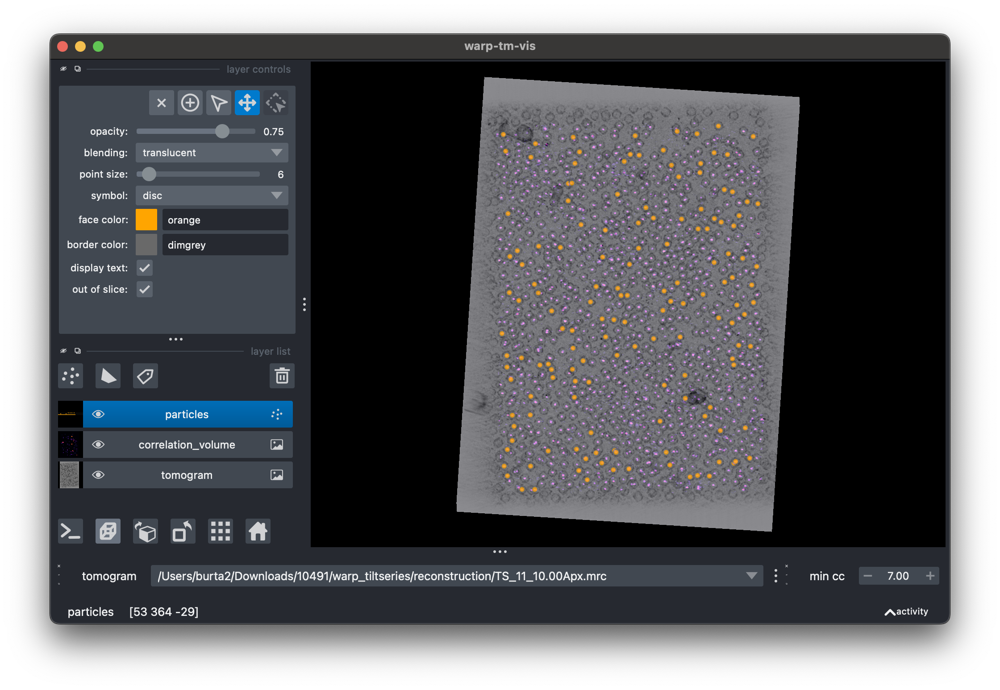

# warp-tm-vis

[](https://github.com/warpem/warp-tm-vis/raw/main/LICENSE)
[](https://pypi.org/project/warp-tm-vis)
[](https://python.org)
[](https://github.com/warpem/warp-tm-vis/actions/workflows/ci.yml)
[](https://codecov.io/gh/warpem/warp-tm-vis)

Visualize template matching results from Warp

## Usage

Install [uv](https://docs.astral.sh/uv/getting-started/installation/) then run 

```shell
uvx warp-tm-vis
```

You should see the following

```txt
╭─ Options ──────────────────────────────────────────────────────────╮
│ *  --reconstruction-directory    -rdir                       PATH  │
│ *  --matching-directory          -mdir                       PATH  │
│ *  --matching-pattern            -mp                         TEXT  │
│ *  --correlation-volume-pattern  -cvp                        TEXT  │
│    --load-volumes                --no-load-volumes                 │
│    --help                                                          │
╰────────────────────────────────────────────────────────────────────╯
```

Note: this is a graphical application which should be run locally, performance over ssh with XForwarding will likely be poor. 
We recommend using an ftp client like [FileZilla](https://filezilla-project.org/) to download your data if it's 
currently stored on a remote server.

Once you've provided the necessary options, you should see a GUI window pop up



## Features
- change between different tomograms
- turn on/off visualization of tomograms, correlation volumes and particle positions
- simulate thresholding results at a given cutoff

## Authorship

*warp-tm-vis* was developed by Alister Burt at Genentech, Inc. in South San Francisco, USA.